# PES-VCS Lab Report
**Name:** Manasi Vipin  
**SRN:** PES1UG24CS260  
**Repository:** [PES1UG24CS260-pes-vcs](https://github.com/manasi2915/PES1UG24CS260-pes-vcs)

---

## Phase 1: Object Storage Foundation

### Implementation
Implemented `object_write` and `object_read` in `object.c`.
- `object_write` prepends a type header (`blob/tree/commit <size>\0`), computes SHA-256 of the full object, and writes atomically using a temp-file-then-rename pattern, sharding into subdirectories by the first 2 hex characters of the hash.
- `object_read` reads the object file, parses the header to extract type and size, recomputes the hash to verify integrity, and returns the data portion after the null byte.

### Screenshot 1A — `./test_objects` output
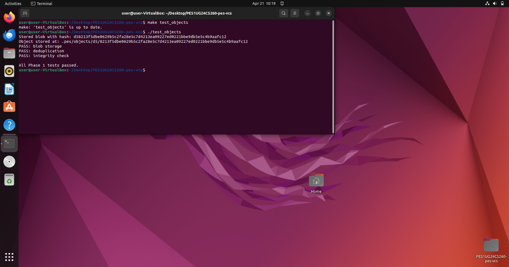

### Screenshot 1B — Sharded object store
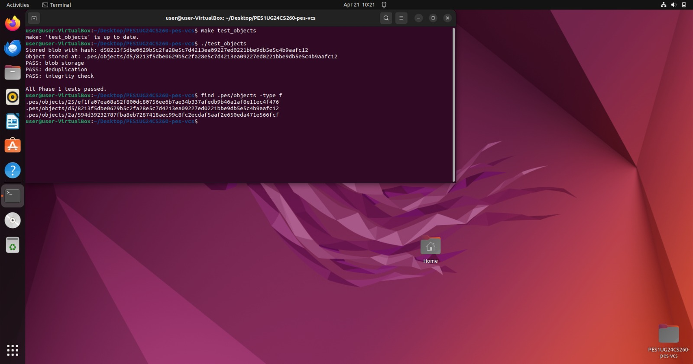

---

## Phase 2: Tree Objects

### Implementation
Implemented `tree_from_index` in `tree.c`.
- Loads the current index, sorts entries by path, and recursively builds a tree hierarchy using `build_tree_level`.
- Handles nested paths (e.g., `src/main.c`) by grouping entries sharing a common prefix into subtrees.
- Serializes each tree and writes it to the object store, returning the root tree hash.

### Screenshot 2A — `./test_tree` output
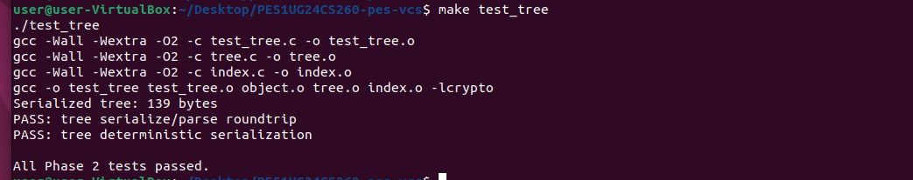

### Screenshot 2B — Raw binary tree object (xxd)
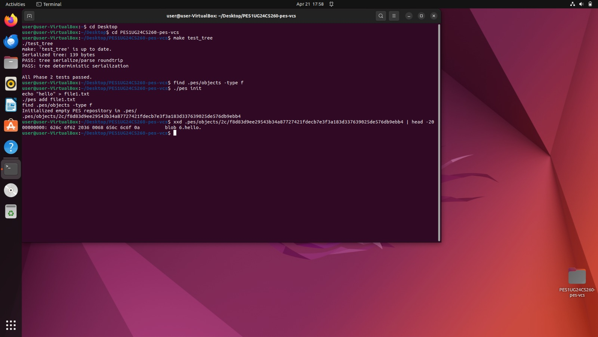

---

## Phase 3: The Index (Staging Area)

### Implementation
Implemented `index_load`, `index_save`, and `index_add` in `index.c`.
- `index_load` reads the `.pes/index` text file line by line, parsing each entry as `<mode> <hash> <mtime> <size> <path>`. If the file doesn't exist, initializes an empty index.
- `index_save` sorts entries by path, writes them atomically to a temp file using `fsync()` before renaming to ensure durability.
- `index_add` reads the file, writes its contents as a blob object to the store, then updates or inserts the index entry with the file's mode, hash, mtime, and size.

### Screenshot 3A — `pes init` → `pes add` → `pes status`
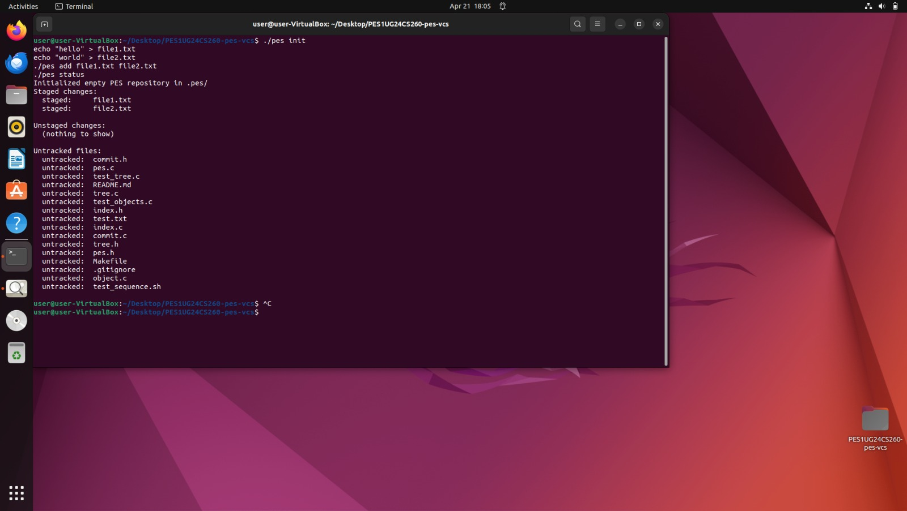

### Screenshot 3B — `cat .pes/index`
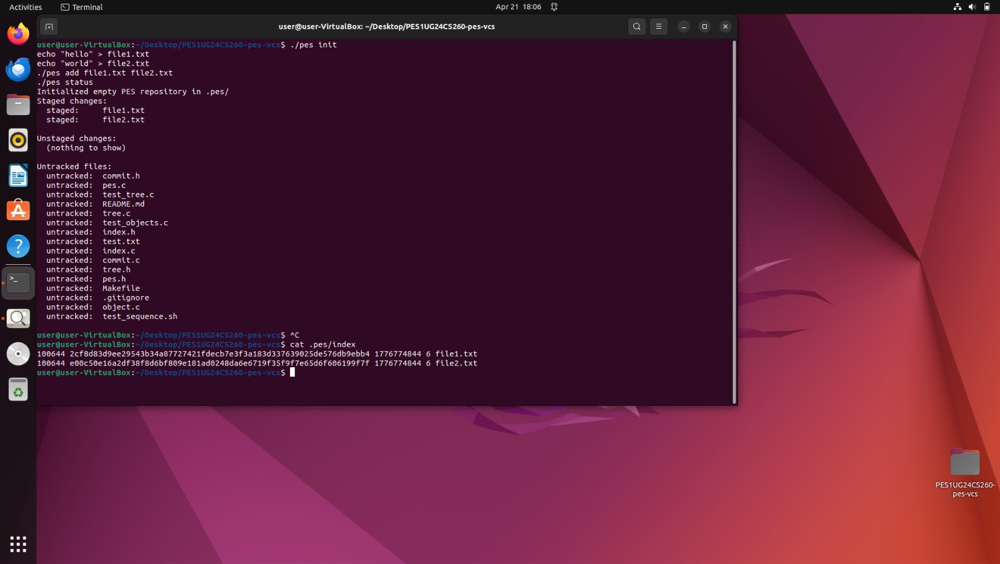

---

## Phase 4: Commits and History

### Implementation
Implemented `commit_create` in `commit.c`.
- Calls `tree_from_index` to snapshot the staged state into a tree hierarchy.
- Reads the current HEAD as the parent commit (skipped for the first commit).
- Populates the `Commit` struct with author, timestamp, and message, then serializes and writes it as a commit object.
- Updates HEAD atomically via `head_update`.

### Screenshot 4A — `./pes log` with three commits
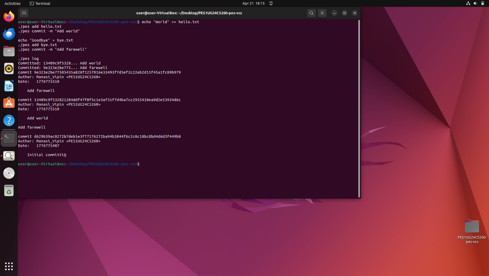

### Screenshot 4B — Object store after three commits
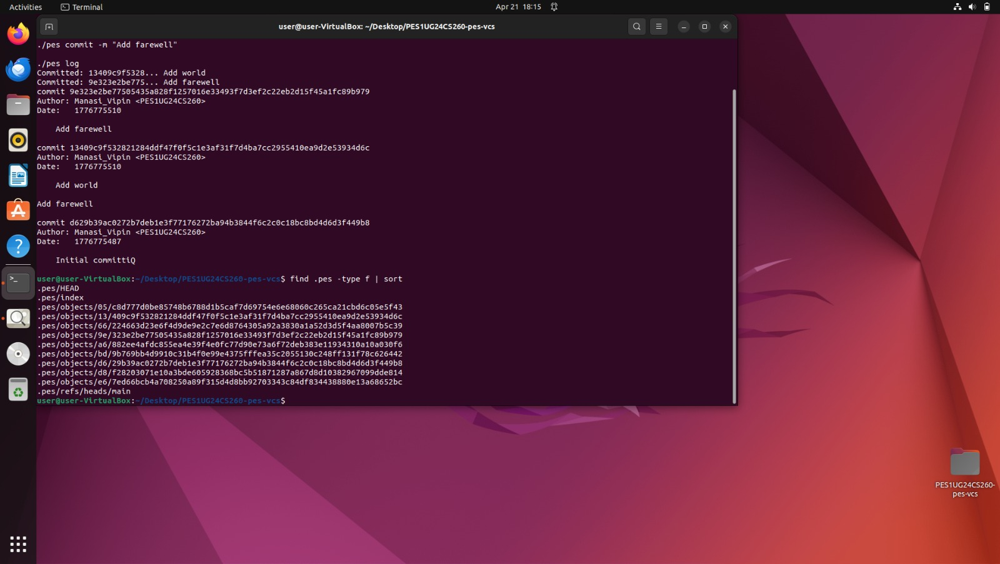

### Screenshot 4C — Reference chain
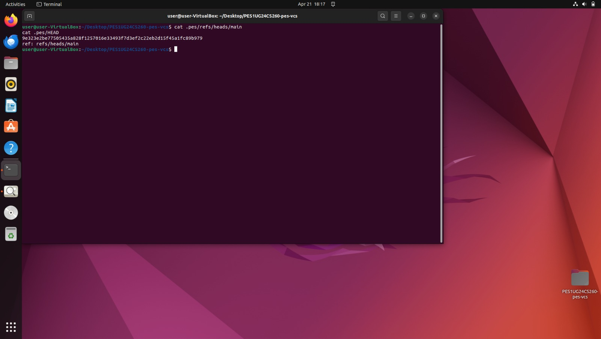

---

## Final Integration Test

### Screenshot — `make test-integration`
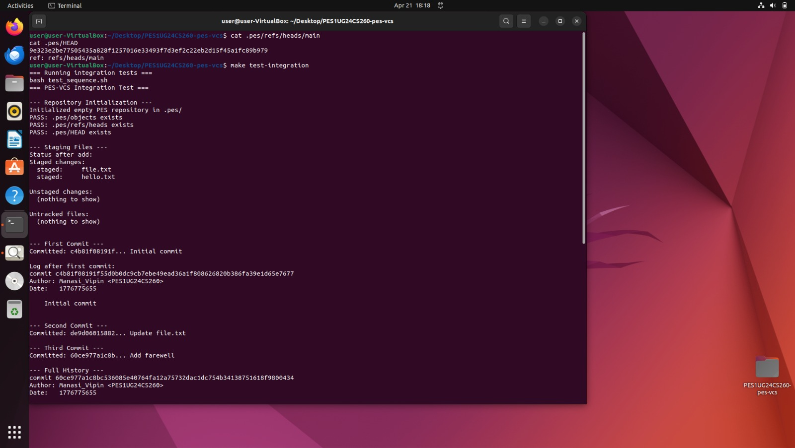
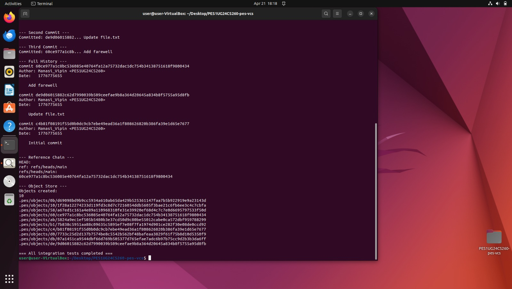

---

## Phase 5: Branching and Checkout (Analysis)

### Q5.1 — Implementing `pes checkout <branch>`

To implement `pes checkout <branch>`, three steps are required. First, verify that `.pes/refs/heads/<branch>` exists. Second, update `.pes/HEAD` to contain `ref: refs/heads/<branch>`. Third, read that branch's latest commit, walk its tree object, and restore every file in the working directory to match the snapshot.

The complexity arises from handling uncommitted local changes safely. If a tracked file has been modified in the working directory and that file also differs between the current branch and the target branch, blindly overwriting it would destroy the user's unsaved work. The implementation must compare each file's current content (or mtime/size as a proxy) against the index before touching it, and refuse to proceed if any conflict is detected.

### Q5.2 — Detecting a Dirty Working Directory

For each file tracked in the index, recompute its blob hash from the current working directory contents and compare it to the hash stored in the index entry. If they differ, the file has been locally modified. Next, look up the same file in the target branch's tree object (retrieved via the target branch's commit → tree). If the blob hash in the target tree differs from the blob hash in the current HEAD's tree for that file, then switching branches would overwrite the local modification. If both conditions are true — local modification exists AND the file differs between branches — checkout must be blocked.

### Q5.3 — Detached HEAD and Recovery

In detached HEAD state, `.pes/HEAD` contains a raw commit hash instead of `ref: refs/heads/<branch>`. New commits are still written correctly to the object store and chained via parent pointers, but no branch file is updated to track them. Once you switch away from the detached state, those commits become unreachable by normal traversal and invisible to `pes log`.

Recovery is possible because the objects still exist in the store. The user can create a new branch pointing directly to the detached commit hash:
```
git branch recover-branch <hash>
git checkout recover-branch
```
This makes the commit reachable again before garbage collection removes it.

---

## Phase 6: Garbage Collection (Analysis)

### Q6.1 — Finding and Deleting Unreachable Objects

The algorithm is mark-and-sweep. Starting from all branch refs (e.g., all files under `.pes/refs/heads/`), traverse every reachable commit by following parent pointers. For each commit, mark its tree object and recursively mark all blob and subtree objects reachable from that tree. Store all visited hashes in a **hash set** for O(1) insertion and lookup.

After the marking phase, scan every file under `.pes/objects/` and delete any object whose hash is not present in the hash set.

For a repository with 100,000 commits and 50 branches: assuming an average of 5 objects per commit (1 commit + 1 root tree + ~3 blobs/trees), the reachability pass would visit roughly **500,000 objects**. The object store scan would visit all objects including unreachable ones, but the hash set membership check keeps each lookup O(1).

### Q6.2 — GC Race Condition with Concurrent Commits

The race condition occurs as follows: GC scans the object store and determines that a particular blob is unreachable (not referenced by any current branch). Concurrently, `pes add` writes that same blob to the store and `pes commit` begins building a tree that references it — but the tree and commit objects have not been written yet. GC deletes the blob. The commit then lands with a dangling reference to a now-deleted object, corrupting the repository.

Git avoids this in two ways. First, it uses a **grace period**: any object newer than 2 weeks is never deleted during GC, giving in-progress operations time to complete. Second, Git takes a **ref lock** before scanning reachability, preventing new commits from landing mid-GC. Together these ensure that no object referenced by a concurrent operation can be prematurely deleted.
